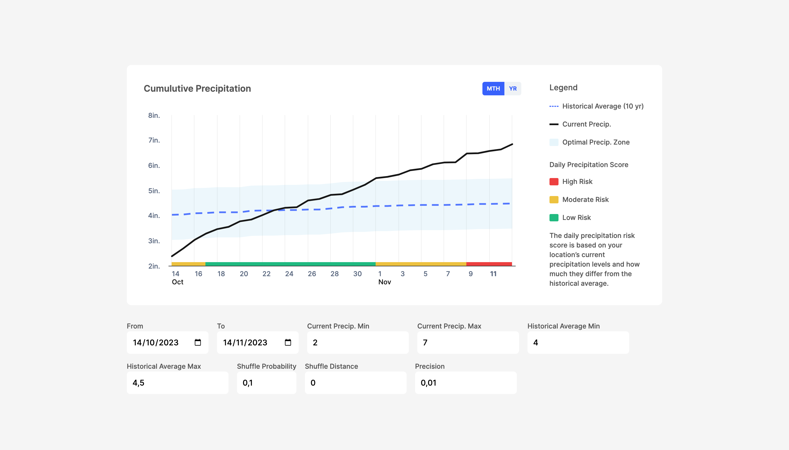

# Highcharts React + Zustand Example

Example of implementation using React with Typescript, Highcharts and Zustand.
It uses a simulated API service that generates random data with Faker.

Run this app using `npm ci && npm start`.

